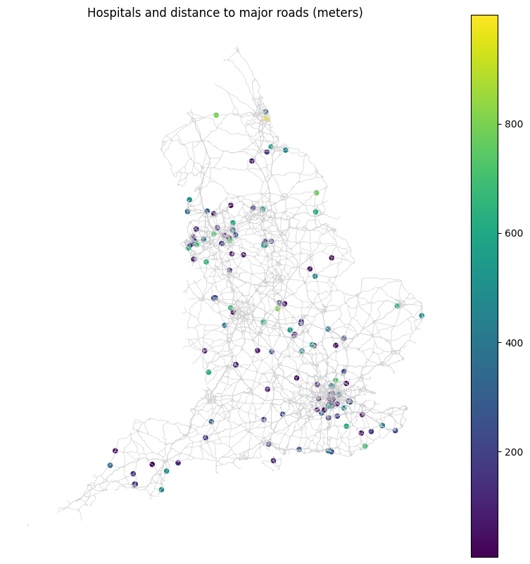

# OpenStreetMap & PostGIS spatial analysis

This repository demonstrates a complete spatial analysis workflow using OpenStreetMap (OSM), PostgreSQL/PostGIS, and Python within a containerized development environment.

The project integrates database setup, spatial SQL queries, and notebook-based analysis to explore, analyze, and visualize vector spatial data.

## Overview

This assignment focuses on building and applying a reproducible spatial analysis workflow:

- Creating and configuring a PostGIS database using Python
- Loading OSM data into PostgreSQL
- Running and interpreting spatial SQL queries
- Executing queries through Jupyter Notebooks
- Adapting the workflow to a new area of interest (England)

The workflow emphasizes the transition from exploratory analysis to structured, repeatable geospatial processing.

## Skills demonstrated

- Working with OpenStreetMap (OSM) data in PostGIS
- Writing and interpreting spatial SQL (PostGIS functions)
- Performing spatial operations (intersection, distance, aggregation)
- Using geography types for accurate distance and area calculations
- Integrating SQL workflows into Python notebooks
- Managing a containerized GIS environment (Docker + Codespaces)

The project follows a consistent workflow:
1. Set up a PostGIS database using Docker in Codespaces
2. Load OSM data using a reusable Python workflow (src/)
3. Explore and test SQL queries directly in PostGIS
4. Execute queries through Jupyter Notebooks
5. Visualize and interpret results
6. Apply the workflow to a new area of interest (England)

### England analysis
This extension of the workflow applies the same PostGIS + notebook pipeline to England, using three queries that move from simple extraction to more applied spatial analysis.

- **Nature reserves** — extracts all protected areas tagged as nature reserves, establishing a baseline dataset of environmentally significant locations.
- **Railway density by county** — summarizes total railway length and normalizes it by county area to highlight regional differences in transportation infrastructure.
- **Hospitals near major roads** — measures how close hospitals are to major road types (motorway, trunk, primary), using distance-based spatial relationships to evaluate accessibility.

#### Example output


Hospitals tend to cluster near major road networks, with many located within relatively short distances, particularly around urban centers.

## Repository structure
```text
.
├── .devcontainer
│   ├── Dockerfile
│   └── devcontainer.json
├── notebooks
│   ├── osm_postgis_england.ipynb
│   ├── osm_postgis_queries.ipynb
│   └── setup_osm_postgis.ipynb
├── output
│   └── hosp_roads_dist_map.png
├── sql
│   ├── arizona
│   │   ├── 01_osm_restaurant_distribution.sql
│   │   ├── 02_osm_park_area_by_county.sql
│   │   ├── 03_osm_restaurants_near_streets.sql
│   │   ├── 04_osm_railway_density_by_county.sql
│   │   └── 05_osm_county_amenity_synthesis.sql
│   └── england
│       ├── 01_osm_nature_reserve_locations.sql
│       ├── 02_osm_railway_density_by_county.sql
│       └── 03_osm_hospitals_near_major_roads.sql
├── src
│   └── setup_osm_postgis.py
├── docker-compose.yml
├── pyproject.toml
├── uv.lock
└── README.md
```

## Notes

- Notebooks are used for exploration, execution, and visualization
- SQL files contain reusable spatial queries organized by region
- OpenStreetMap data is downloaded dynamically and not stored in the repository
- The database runs in a separate PostGIS container via Docker
- Queries use a projected/geography-aware approach to ensure accurate measurements
